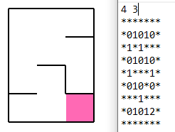

# q-learning-labyrinth-solver

A visual representation of a q-learning algorithm solving a labyrinth. The project is being developed with Python and pygame modules. 

Q-learning is a model-free reinforcement learning algorithm. Q-learning is also an unsupervised training algorithm and therefore it does not use examples or previously known references.

As of reinforcement learning, q-learning involves an agent, a set of states and set of actions. In my application: 

* The agent is an entity that wants to reach a target/goal position.
* A state would be the current position of the agent.
* A action would be the agent movement to an adjacent position.

Q-learning also involves a reward matrix (the R matrix) and a memory/knowledge matrix with all (state, action) pairs and values possible. Q-learning also features a random exploration chance, a chance to decide the next move randomly, to allow the agent to potentially discover new and more rewarding decisions. The random exploration chance will be decremented during the agent's training. Currently, the learning rate is fixed at 0.8.

My application builds a map from a map file, currently in "example_map.txt". The first represents the map height and the map width, respectively.

* '*': Indicates a wall or blocking object
* '0': An empty square
* '1': Indicates a path between two squares
* '2': Indicates goal position

Before training, all values in the Q value matrix are 0's and the exploration chance is high:

After training, the agent has a memory/knowledge (filled Q matrix) of the path to the target/goal position and the exploration chance is very low or simply 0%:

